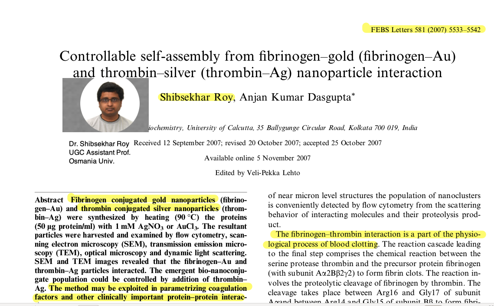
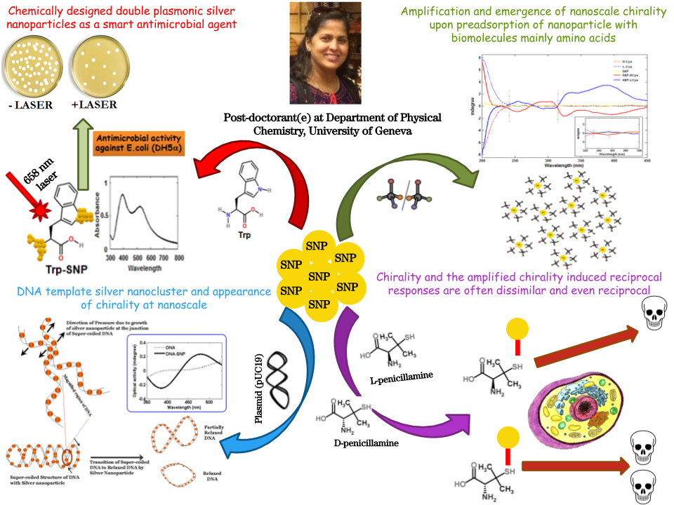
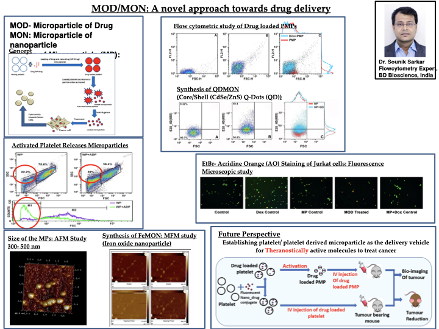

  

```{r setup, include=FALSE}
knitr::opts_chunk$set(echo = TRUE)
```


# Prelude 
\small
Hitchhiking is an unstructured but primitive pivot for human quests. We have hitchhiking traits in our genes. Genetic hitchhiking (or genetic drift) is allele frequency change, caused by neighbouring genes.


\begin{figure}
\includegraphics{hij1.png}
\end{figure}


# Quote

\small
"Tiny hitchhikers attack cancer cells: Gold nanostars first to deliver drug" - *Is it like requesting a UFO for a ride?*

{width=50%}


# Failed in Bio - Created nano

- Nanotechnology has evolved as a result of some inherent shortcoming of related branches of science e.g., biology (hitchhiking of the third kind!). 
- Feynman realized, one needs a science like nanotechnology only after he was frustrated with his biology PostDoc.


# Definitions 

- **Nanoscience** is the study of structures and materials on an ultra-small scale (A nanometre is one billionth of a metre).The physical and chemical properties of matter change at the nano level.

- **Nanotechnology** has the potential to revolutionise a diverse range of fields, from health care to manufacturing, agriculture to environment, textile to sensing.

# Nanomaterials Database
If 50% or more of the constituent particles of a material in the number size distribution have one or more external dimensions in the size range 1 nm to 100 nm, then the material is a nanomaterial.

- <http://www.pubvinas.com>
- <https://cananolab.nci.nih.gov/caNanoLab/#/>


# Classification 
The classification of nanomaterials is based on the

- *number of dimensions of a material, which are outside the nanoscale (<100 nm) range*.

# Examples of Dimensionality variations

\small
## 0D
Accordingly, in zero-dimensional (0D) nanomaterials all the dimensions are measured within the nanoscale (they are essentially  tiny 3D materials). **Qdots** are often termed as 0D material. 

## 1D
In one-dimensional nanomaterials (1D), one dimension is outside the nanoscale. **Borophene,Graphene,SAM**

## 2D 
In two-dimensional nanomaterials (2D), two dimensions are outside the nanoscale. **Nanofibres,Nanorod,Nanotube,Nanowire,Quantum wire**

## 3D 
Three-dimensional nanomaterials (3D) are materials that are not confined to the nanoscale in any dimension. 


# Nano-Trends 


# Our Nanotour began in the year 2006 


# First ever nanobio meet ever held


# The Nano center proposal

The proposal for the nano center came out in the next year - A significant portion of the proposal contained the small progress that we achieved in our lab at that time.


# 0.01
- We started our almost random nanowalk in the year 2006 
- Jaydeep was working on the folding of a protein which most of the protein scientists avoid, but many medical biologists love 
- It was hemoglobin
- The clinical angle came out from the fact that the hemoglobin structure varies considerably in a disease called thalassemia
- With the help of Dr. P.Sen who was in possession of copper nanoparticles (using top-down ball mill methods) we attempted to study Hb folding using CuNP

# 1.10

{width=105%}


# 1.11

- In the mean time a new student Tapan (late Tapan Das) synthesized AuNP in our lab. 
- Jaydeep thought it worth trying to probe hemoglobin folding using AuNP


# 1.12


# 1.21

- Ranjita was contemporary to Jaydeep and was gaining experience in a MD simulation  project.
- She joined in my newly funded DST project on protein Glycation

# 1.22

- Ranjita came out with an interesting observation that there is a **systematic but compensatory unfolding of protein**  it is subjected to synthetic glycation.
- She published a comprehensive paper on this topic in the BBA.
- We thought it worth trying to probe the glycation level using Au seeding
- The result was that different levels of glycation led to different sizes of AuNP formation (showing different colors). 
- A primitive glycation sensor was reported.


# 1.23

{width=120%}


# 1.31 

- All of us knew that there is protein aggregation as a result of misfolding.
- But the direct proof of formation of the extended structure was rare. 
- Shibsekhar's entry in my lab was simultaneous with the introduction of a UGC supported instrument zeta size analyzer (Malvern DLS). Most of my colleagues used to look at that instrument with a pinch of suspicion (how it will be useful in a Biochemistry Department).
- Shibsekhar made a direct measurement of the size of the extended structure of Cyt C. 
- Eventually, that was also his entry point to the nanoworld. 
- I must mention that Shib was the key to the 2006 nano-meet.


# 1.32 


# 1.33 


# 1.3X1

Tapan was in my lab for a short while.
- Before he left us forever he made an interesting contribution.
- I thank Shibselkar for completing his publication after his premature exit.

# 1.3X2


# 1.3X3


# 1.41
- Just when Jaydeep Ranjita and Shibsekhar were experimenting on sensing some clinically important protein phenomena, Santi joined. 
- When nothing interesting was happening to him for a  year long spell, he thought of exploring the possibility of chaperons properties of AuNP. 


# 1.42 


# 1.43
- But this was not all. He looked into protein glycation from another perspective.
- Not as glycation sensor
- But as antiglycating agent


# 1.44 


# 1.51

\small
- While this lab was comfortable with protein problems  a talented biologist, Suryyani Deb  joined. 
-  As a matter of coincidence, I just started a Calcutta Medical college collaboration.
- She joined the newly initiated platelet aggregation project.
- She did initial work on agonist thresholding and then switched over to nano-bio.
- Needless to say, she did pioneering work in the field of nanotoxicology
- Her investigations proved the type and size of nanoparticles that would be safe for a nano-drug.

# 1.52


# 1.53


# 1.61

- Our first tryst with cancer cell nanoparticle interaction started with Hirak.
- What became a solid new finding by Hirak was the cell specificity of the nanoparticle interaction. 
- The other new finding was the selectivity of the size distribution - some nano-sizes were more probable than others. 


# 1.62 


# 1.71
- Then came Sarita
- Sarita wanted to try silver nanoparticle 
- The rule of the thumb was that she wanted to do something totally different - Being from chemistry she was fascinated by the chirality concept. 
- She started studying chilarlity of AgNPs. 

# 1.72




# 1.81

- It was a memorable moment in the lab when Raja joined 
- like everyone else in the lab, he wanted to do something new and totally different. 
- I asked him to probe into a challenging problem in biology 
- Role of a static magnetic field. 

# 1.82 


# 1.91

- Tamoghna was the first person in the lab to try a carbon nanomaterial 
- He got himself trained in IIT Kanpur to an expert in carbon nanomaterial
- After some efforts, he came up with the idea of studying the interaction of SWNT and lipids. 

# 1.92 


# 1.93 


# 2.11

- Shounik initially worked in Medical college. 
- At one stage he became interested in nanoparticle effects.
- His work on platelet cancer cell interaction is getting citations even today. 
- His work on MON (microparticles of nanoparticles) is also an interesting concept. 

# 2.12



# 2.21

- Azhar used nanotechnology of eye disease. 
- He is still doing something related to the nanotechnology of the cornea. 
- But here is what he did during his PhD

# 2.22 


# 2.31
- Abhishek was one student who made me nervous as he was a plant science student, a background unfamiliar to me.
- Abhishek started working on the spectrscopic studies on plant photosynthtic system 
- In the process he came up with an interesting sensing behaviour of Chl A Nanoparticle. 

# 2.32 


# 2.41

- Jyoti was the first microbiologist in my lab
- She almost completed a PhD in genetics of mental health
- But suddenly she became interested in nanobiology. 
- She made an interesting observation  that normal cells are affected less by Static magnetic field as compared to cancer cells. 

# 2.42 

{width=50%}


# 2.51 

- Sanhita started working on an entirely different problem, namely biofilms.
- She looked into the nanointerface of biofilm with nano-materials.
- She also came out with the POC of an  oxygen sensor 
- Her next contribbution was nano-inspired synthetic biology. By conjugating the microbial surface with magnetic NP, and then using SMF. 
- Interaction with biofilms with  2D Dirac material (graphene) led to emergence of a new electrical and optical property. 

# 2.52 


# 2.53


# 2.54

[width=125%]

# 2.61
\small
- I am now describing almost the concluding part of my nano tour.
- Anirban's work was about microbe graphene interaction.
- He was part of the oxygen sensing work initiated by Sanhita
- He reported amplification of fluorescence by photosynthetic bacteria under some critical parameter windows
- His nano-work involved material-cognition by photosynthetic microbes ( bacterial specificity for interaction with graphene, and graphene specificity for interaction with microbes)

# 2.62 


# Back to basics
- After this hectic tour a few thoughts haunted me 
- Do we understand nano-science?
- Let us try to explain the plasmon.

# Plasmonic extinction 
The equation expressing the extinction cross section of a spherical nanoparticle within the quasistatic approximation is given by:

\begin{equation}
C_{ext}= 24 \pi^2 R^3 \frac{ \epsilon_m ^{1.5} }{\lambda} \cdot \frac{\epsilon_2}{(\epsilon_1+2\epsilon_M)^2+\epsilon_2^2}
\end{equation}


# Why this simple explanation fails?

- The equation predicts that the resonant condition will be independent of the particle size i.e., $\epsilon_1=-2\epsilon_M$ is independent of R. 
- But we know that the plasmon resonance changes as the particle size becomes smaller
- Drude equation that overcomes the limitations of the free electron gas approximation.

# Modified Drude 
If $\gamma$ is a medium dependent damping factor,
\begin{align}
\omega_p= \sqrt{\frac{me^2}{m_{eff}\epsilon_0}}\\
\epsilon(\omega,k)= 1- \frac{\omega_p^2}{\omega.(\omega+i\gamma)-\beta^2k^2} + \epsilon_{IB}(\omega)
\end{align}

The resonance then becomes size-dependent. 

# A particle in a box approach - The size & shape effect

 **Spherical nanoparticle**:
\begin{equation}
E_{nl}=\frac{\hbar^2\chi_{nl}^2}{2m_eR^2}
\end{equation}
where, $\chi_{nl}$ in the n-th root of the i-th order spherical Bessel function. </p></p>
**Cubic nanoparticle**:

\begin{equation}
E_{nml}=\frac{\hbar^2\pi^2}{2m_e a^2}(n^2+m^2+l^2)
\end{equation}


# Miepython 
\tiny
We use a simulation perspective of Mie scattering
is a pure Python module to calculate light scattering by non-absorbing, partially-absorbing, or perfectly conducting spheres.

```
import numpy as np
import matplotlib.pyplot as plt
import miepython


# wavelength in microns

radius = 0.1            # in microns
num = len(ref_lam)
m = ref_n-1.0j*ref_k
x = 2*np.pi*radius/ref_lam

qqabs = np.zeros(num)
qqsca = np.zeros(num)

for i in range(num) :
    qext, qsca, qback, g = miepython.mie(m[i],x[i])
    qabs = qext - qsca
    qqabs[i]=qabs*np.pi*radius**2
    qqsca[i]=qsca*np.pi*radius**2
    
plt.plot(ref_lam*1000, qqabs, color='blue')
plt.plot(ref_lam*1000, qqsca, color='red')

plt.title(r"Gold Spheres 100nm diameter")
plt.xlabel("Wavelength (nm)")
plt.ylabel(r"Cross Section ($\mu$m$^2$)")
plt.annotate("absorption", xy=(700,0.01), color='blue')
plt.annotate("scattering", xy=(750,0.1), color='red')
plt.show()
```

# Plasmon simulation 

<centre>

</centre>

# A note for the "unsmarts"

When size of the NP is reduced from 100 nm to 30 nm 
- Scattering intensity is lowered relative to the absorbance 
- The intensity of both scattering and absorbance lowers
- With higher wavelength scattering is red-shifted to a signifiant extent,absorbance slifgtly blue shifted.


# The Sensing lies in the eye of the detector

\small
- Why there is a Difference between the Absorbance and Fluorescence detections system?
- Those who have tried to measure plasmon resonance using different detection systems will realize that we often get significant variations in the plasmonic frequency when we use a spectrophotometer (abs based) as compared a fluorimeter (scattering based). 
- The design of nanosensors may be enriched if these basics of nanoscience are clearer to us.

# Future Directions 

- The main challenges in nanotechnology are the following:
- Existential; Will the technology will merge with other sister disciplines or it will retain an independent existence 
- How nanotechnology can merge with other trending disciplines like chip development and/or big data 
- How nanoscience can contribute to the emerging disciplines of quantum biology/quantum computation. 
- It is however important for us to realize that we will never have a technology that is sub-nano but would retain the identity of molecules constituting a given material. 
- Below nanoscale, the atoms are no more atoms, and the science therein belongs to a different world of physics (subatomic). 

# Deep learning the Nanoworld

- We are poor in **nano-aerosol** interaction. It will be interesting to probe how nanoforms can be exploited in sanitizing the air quality or removing the undesirable toxicants from the air. 
- Nanotechnology may be used in the **pulp and paper** industry
- **Medical textiles** for Nanofiber-based 'smart' dressings.
- Printed papers using **nanoparticle-based electronic component** (inks of graphene, gold, and silver is already available)
- We may use **nanomaterials for developing effective sanitations** (important post-COVID step). 
- A deeper understanding of biomaterials nanomaterial interaction would enable us to fabricate smarter sensors. 

# Gunther Stent's Prediction & a Ray of Hope 

- By 1969, Dr. Stent “was bored with molecular biology,”.
- It was just after that, the restriction enzymes were discovered and molecular biology underwent a second revolution. 
- Nanotech is perhaps waiting for such a second generation revolution.
- Planck had the similar experience when he joined in a physics lab at 16. He was told by Jolly that all one needs in physics is filling up a few holes. Rest are all known.

# Nanosmart to NanoGate

https://phys.org/news/2020-09-nanoparticle-based-architecture-nanoparticle-neural-networks.html


# Their story 
- Then they calculated the number of nanoparticle nodes needed to functionally complete Boolean logic operators on the neural network. 
- The hardware relied on covalently modified nanostructures on a lipid chip for multiple executions. 
- They tested the reset function of the system for reusability by de-hybridizing all DNA assemblies after exchanging the buffer solution in the setup. 
- The reset allowed thiolated DNAs alone to remain on the nanoparticles, thereby returning to the initial state for the next function.


# Nano- AI 


# At the END
